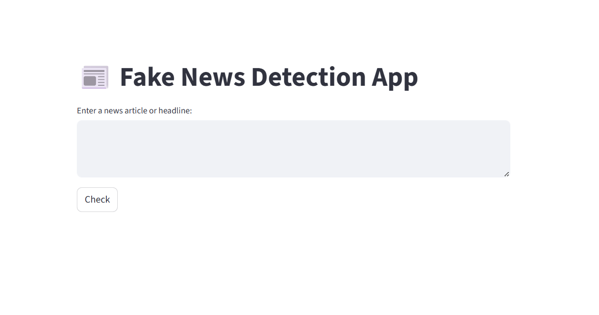

📰 Fake News Detection App
A simple web app that detects whether a news article or headline is real or fake using NLP and Machine Learning.


### 🔗 [Live Demo](https://project-xtpggb5gkkk7kmvrbxjndm.streamlit.app)



## Quickstart
```bash
git clone https://github.com/yourname/fake-news-detector.git
cd fake-news-detector
pip install -r requirements.txt
streamlit run app.py
